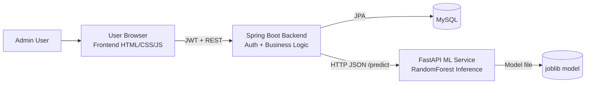

# AI Medical Assistant

> **Disclaimer:** “This system provides preliminary medical guidance and does not replace professional medical consultation.”

AI Medical Assistant is a microservice-based platform that combines a Spring Boot API, a FastAPI machine learning inference service, and a responsive frontend to help users assess symptom combinations and receive preliminary disease predictions.

## Step-by-step build (aligned with the requested 15-step process)

### STEP 1: System Architecture



**Interaction flow**
1. User authenticates (`/api/auth/login`) and receives JWT.
2. Frontend sends symptom payload with JWT to Spring Boot (`/api/predictions`).
3. Spring Boot validates user, stores request metadata, and calls FastAPI `/predict`.
4. FastAPI loads the trained RandomForest model, predicts disease and confidence.
5. Spring Boot persists prediction history in MySQL and returns response to frontend.
6. Admin endpoints manage diseases/symptoms and review logs.

### STEP 2: Folder Structure

```text
AI-Medical-Assistant
├── frontend/                 # Responsive UI pages and JS API integration
├── backend/                  # Spring Boot microservice (auth, business logic, persistence)
├── ml-service/               # FastAPI ML service and training pipeline
├── database/                 # SQL schema and seed scripts
├── docs/                     # Architecture, API docs, UML, deployment guide
└── README.md                 # Master project documentation
```

### STEP 3: Database Schema
- Implemented in `database/schema.sql`.
- Core tables: `users`, `symptoms`, `diseases`, `disease_symptoms`, `predictions`.

### STEP 4: ML Model
- Training pipeline: `ml-service/train_model.py`
- Uses `RandomForestClassifier`, multi-label binarization for symptoms, and train/test split.

### STEP 5: FastAPI ML API
- Endpoint: `POST /predict`
- Input: symptom list
- Output: predicted disease + confidence + top probabilities

### STEP 6: Spring Boot Backend
- MVC/Clean layering in `controller/service/repository/model/security/config`
- OpenFeign client for ML communication.

### STEP 7: Authentication
- Registration/login with BCrypt.
- JWT token creation and filter-based validation.

### STEP 8: Prediction Backend Flow
- Workflow implemented: Frontend → Spring Boot → FastAPI → MySQL → Frontend.

### STEP 9: Frontend UI
Pages:
- Home (`frontend/index.html`)
- Login/Register
- Symptom Checker
- Prediction Result
- Disease Info
- Admin Dashboard

### STEP 10: Admin Dashboard
- CRUD-ready UI + backend endpoints for diseases/symptoms.
- Prediction log endpoint for monitoring.

### STEP 11: Error Handling
- Global exception mapper with structured response + HTTP status codes.

### STEP 12: Security
- JWT auth, request validation, JPA parameterization, CORS config.

### STEP 13: API Documentation
- See `docs/api/endpoints.md`.

### STEP 14: UML Diagrams
- See `docs/uml/*.md` (Use Case, ER, Sequence, Architecture).

### STEP 15: Deployment Instructions
- See `docs/deployment/deployment-guide.md`.

## Quick start

### 1) Database
```bash
mysql -u root -p < database/schema.sql
```

### 2) Train ML model
```bash
cd ml-service
python3 -m venv .venv && source .venv/bin/activate
pip install -r requirements.txt
python train_model.py
uvicorn app.main:app --reload --port 8001
```

### 3) Start backend
```bash
cd backend
mvn spring-boot:run
```

### 4) Serve frontend
```bash
cd frontend
python3 -m http.server 8080
```

Open `http://localhost:8080`.

## Production notes
- Put backend + ML behind API gateway / ingress.
- Store JWT secret in secret manager.
- Configure TLS for all services.
- Enable DB backups and auditing.
