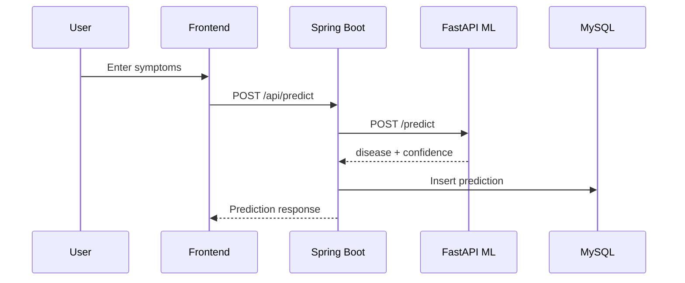

# Sequence Diagram

```mermaid
sequenceDiagram
  participant U as User
  participant F as Frontend
  participant B as Spring Boot
  participant M as FastAPI ML
  participant D as MySQL
  U->>F: Enter symptoms
  F->>B: POST /api/predict
  B->>M: POST /predict
  M-->>B: disease + confidence
  B->>D: Insert prediction
  B-->>F: Prediction response
```
