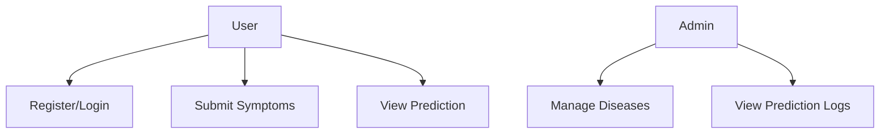

# Use Case Diagram

```mermaid
flowchart TB
  User --> UC1[Register/Login]
  User --> UC2[Submit Symptoms]
  User --> UC3[View Prediction]
  Admin --> UC4[Manage Diseases]
  Admin --> UC5[View Prediction Logs]
```
